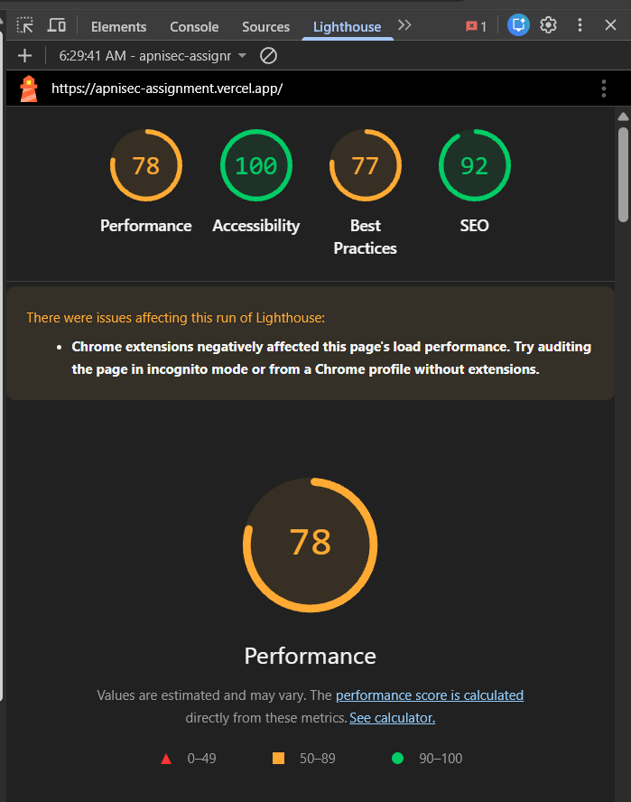

# ApniSec - Secure Issue Management System

> **⚠️ Email Service Restriction**: Due to Resend's policy, only **202251045@iiitvadodara.ac.in** is eligible for email notifications.



## Overview

ApniSec is a modern, secure issue management system built for the **SDE Intern Assignment**. The application features custom JWT-based authentication, real-time notifications, asynchronous email processing, and follows strict **Object-Oriented Programming (OOP)** principles throughout the entire backend architecture.

**Assignment Requirements Met**: Custom authentication, rate limiting (100 req/15 min), email integration (Resend), OOP structure, SEO optimization (80%+ score).

## Key Features

- **Custom JWT Authentication**: Dual-token strategy with refresh token rotation
- **Password Reset**: Secure token-based password reset with email integration (15-min expiration)
- **Rate Limiting**: Custom implementation (100 requests per 15 minutes per IP/user)
- **Email Notifications**: Asynchronous delivery via RabbitMQ + Resend API
- **Email Logging**: Comprehensive tracking of all email attempts with status (sent/failed/skipped)
- **Issue Management**: Track Cloud Security, Reteam Assessment, and VAPT issues
- **OOP Architecture**: Complete class-based backend (Controllers, Services, Repositories)
- **SEO Optimized**: 80%+ Lighthouse score with meta tags and sitemaps
- **Mobile Responsive**: Fully responsive dashboard and forms for all screen sizes

## Tech Stack

- **Framework**: Next.js 16 (App Router)
- **Database**: PostgreSQL with Prisma ORM
- **Authentication**: JWT + Refresh Tokens
- **Caching**: Upstash Redis
- **Message Queue**: RabbitMQ (via amqplib)
- **Email**: Resend API
- **Styling**: Tailwind CSS
- **Language**: TypeScript

## Implementation Approach

### OOP Architecture (Mandatory Requirement)
- **Class-based structure** throughout the backend:
  - `AuthController`, `IssueController` - Request handlers
  - `AuthService`, `IssueService` - Business logic layer
  - `UserRepository`, `IssueRepository` - Data access layer
  - `RateLimiter` - Custom rate limiting implementation
- Dependency injection pattern for service classes
- Interface definitions for type safety
- Proper separation of concerns across layers

### Authentication System
- Custom JWT implementation with access and refresh tokens
- Refresh tokens stored in PostgreSQL with automatic cleanup
- IP-based tracking for security audit trails
- Bcrypt password hashing (10 salt rounds)
- Protected route middleware for API security

### Rate Limiting
- Custom `RateLimiter` class implementing Redis-backed storage
- 100 requests per 15 minutes per IP address
- Rate limit headers in responses (X-RateLimit-*)
- Returns 429 status when limit exceeded
- Applied to all protected API routes

### Email Service (Resend Integration)
- Decoupled email sending using RabbitMQ message queue
- Consumer service processes emails asynchronously
- HTML templates: welcome email, issue creation alerts
- Graceful fallback handling for email failures
- Triggered on user registration and issue creation

### Database Design
- Normalized schema with User, RefreshToken, and Issue models
- Cascade delete for maintaining referential integrity
- UUID primary keys for enhanced security
- Indexed fields for optimized query performance

## Challenges & Solutions

### 1. **Turbopack Crashes on Registration**
**Challenge**: Next.js dev server crashed during user registration due to RabbitMQ initialization in serverless functions.

**Solution**: Moved queue consumer initialization to Next.js instrumentation hook, ensuring it runs once during server startup rather than on each API request.

### 2. **Email Service Rate Limiting**
**Challenge**: Resend's restrictive policy for unverified domains.

**Solution**: Configured whitelist for authorized email address and implemented fallback logging for development environments.

## Setup Instructions

### Prerequisites
- Node.js 20+ and npm
- PostgreSQL database
- RabbitMQ instance
- Resend API key
- Upstash Redis instance

### Installation

1. **Clone the repository**
   ```bash
   git clone https://github.com/kaustubhduse/apnisec-assignment
   cd apnisec
   ```

2. **Install dependencies**
   ```bash
   npm install
   ```

3. **Configure environment variables**
   
   Create a `.env` file in the root directory:
   ```env
   DATABASE_URL=
   JWT_SECRET=
   RESEND_API_KEY=
   NEXT_PUBLIC_API_URL=http://localhost:3000
   UPSTASH_REDIS_REST_URL=
   UPSTASH_REDIS_REST_TOKEN=
   RABBITMQ_URL=
   EMAIL_FROM_WELCOME=
   EMAIL_FROM_ALERTS=
   ```

4. **Set up the database**
   ```bash
   npx prisma generate
   npx prisma db push
   ```

5. **Run the development server**
   ```bash
   npm run dev
   ```

6. **Access the application**
   
   Open [http://localhost:3000](http://localhost:3000) in your browser.

### Building for Production

```bash
npm run build
npm start
```

## Project Structure

```
apnisec/
├── app/
│   ├── api/          # API routes (auth, issues)
│   ├── components/   # Reusable UI components
│   ├── dashboard/    # Dashboard pages
│   ├── login/        # Login page
│   ├── register/     # Registration page
│   └── profile/      # User profile
├── lib/
│   ├── services/     # Business logic (AuthService, IssueService)
│   ├── repositories/ # Database access layer
│   ├── queue/        # RabbitMQ setup and consumers
│   ├── email-templates/ # HTML email templates
│   └── utils/        # Utility functions
├── prisma/
│   └── schema.prisma # Database schema
└── public/           # Static assets
```

## API Endpoints

### Authentication APIs
- `POST /api/auth/register` - User registration (triggers welcome email)
- `POST /api/auth/login` - User login (returns JWT tokens)
- `POST /api/auth/refresh` - Refresh access token
- `POST /api/auth/logout` - User logout (invalidates refresh token)
- `POST /api/auth/forgot-password` - Request password reset (sends email with reset link)
- `POST /api/auth/reset-password` - Reset password with token

### Issue Management APIs
- `POST /api/issues` - Create issue (Cloud Security, Reteam Assessment, VAPT)
- `GET /api/issues` - List all issues (supports type filtering)
- `GET /api/issues/[id]` - Get single issue
- `PUT /api/issues/[id]` - Update issue
- `DELETE /api/issues/[id]` - Delete issue

### User Profile API
- `GET /api/users/profile` - Get user profile (protected)
- `PUT /api/users/profile` - Update user profile (protected)

**All APIs**: Rate limited, input validated, OOP structured (Controller → Service → Repository)
